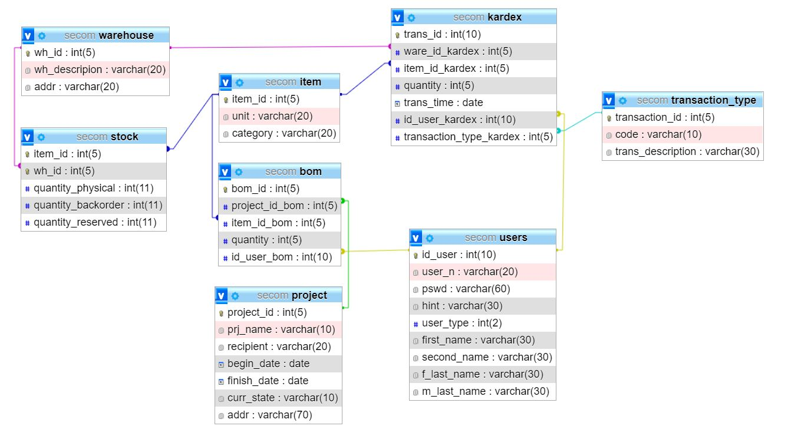

# Inventory Manager
[](https://www.python.org/)
[](https://www.mysql.com/)


## Members
- [Rafael Jimenez](https://github.com/rafaeljimenez01)
- [Joshua Hernandez](https://github.com/josh-hdz)


## What are you interested in?
<details open="open">
  <summary>Table of Contents</summary>
  <ol>
    <li>
      <a href="#about-the-project">About The Project</a>
    </li>
    <li>
      <a href="#getting-started">Getting Started</a>
      <ul>
        <li><a href="#prerequisites">Prerequisites</a></li>
        <li><a href="#using-the-app">Using the app</a></li>
        <li><a href="#developing">Developing</a></li>
      </ul>
    </li>
    <li><a href="#project-overview">Project Overview</a></li>
    <li><a href="#license">License</a></li>
    <li><a href="#contact">Contact</a></li>
    <li><a href="#acknowledgements">Acknowledgements</a></li>
  </ol>
</details>


## About The Project


The app is designed to help a small company keep track of their inventory, projects and staff.

The inventory can be managed in different warehouses, and every transaction of material is registered in a Kardex.

The company can determine the material needed for every project, helping them organize the warehouse properly and keep track of how every material is being used.

Here's why:
* Resource planning software is very expensive, and we weren't able to find a open-source version for small business.
* We were looking for a challenging project that would let us develop new skills.

If you would like to contribute please be sure to reach out via Twitter or email. Sometimes we don't have enough time to continue developing the project

A list of commonly used resources that I find helpful are listed in the acknowledgements.

## Getting Started
The project is being develop in [Ubuntu 20.04.2.0](https://ubuntu.com/download/desktop).

For the database we are using [MySQL Server](https://www.digitalocean.com/community/tutorials/how-to-install-mysql-on-ubuntu-20-04) . In order to properly set up the users please reffer to [requirements.txt](requirements.txt)

### Prerequisites

1. Complete Getting Started

2. Install every library mentioned in [requirements.txt](requirements.txt) utilizing pip or pip3


### Using the app
1. Please go to [__main.py__](src/__main__.py) and change this portion of the code.
```python

  root.views[root._conv("LIWind")].user_ety.insert(0, "josh-hdz")
  root.views[root._conv("LIWind")].pswd_ety.insert(0, os.environ.get("DB_PSWD"))
  root.views[root._conv("LIWind")].logIn_btn.invoke()

```
Please note that this will work if you utilized the same password for the MySQL server user, and the new user inside the database, if not you can pass the password as a string.

If you haven't created a user. Please access mysql and create a user of 'Admin' type. Please note that the password you enter will be encrypted before saved. Please write down your password somewhere safe :smile:
 
### Developing 


## Project Overview

The database was designed as following.



## License

Distributed under the GPL-3.0 License. See `LICENSE` for more information.

## Contact

Rafael Jimenez - [@01RafaelJimenez](https://https://twitter.com/01RafaelJimenez) - rafaeljimenez_01@hotmail.com

Project Link: [https://github.com/josh-hdz/secom](https://github.com/josh-hdz/secom)

## Reffer 

[MySQL Server Installation Guide](https://docs.vultr.com/how-to-install-mysql-on-ubuntu-24-04) 

## Acknowledgements
* [README template](https://github.com/othneildrew/Best-README-Template)
